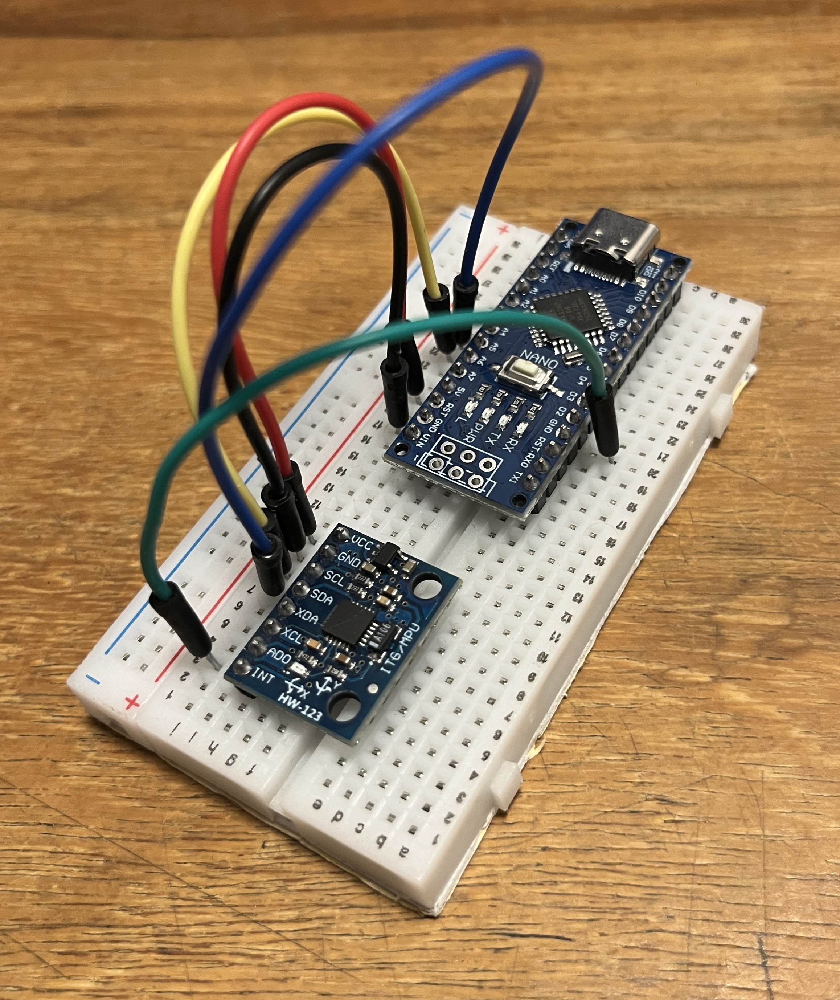
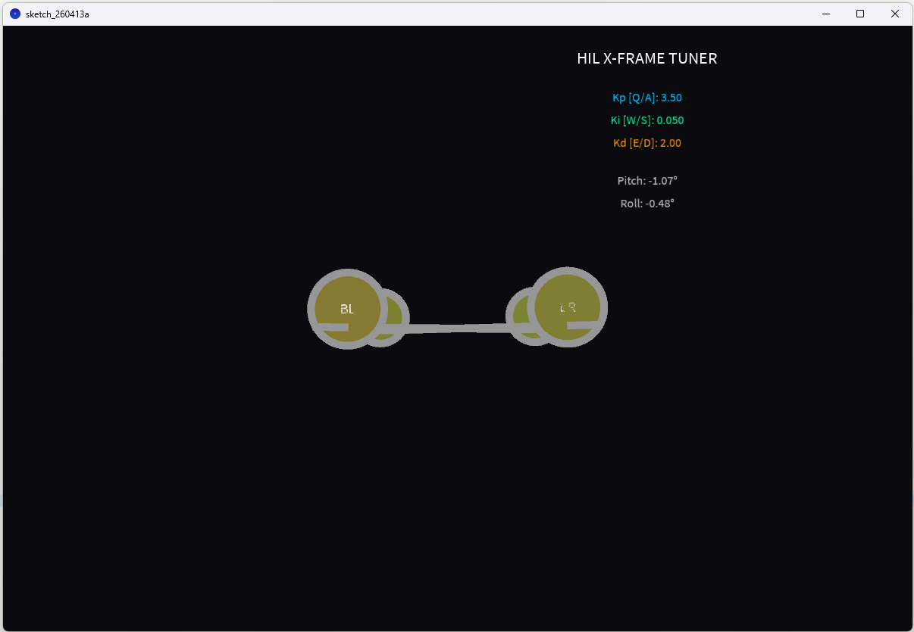

# Real-Time Digital Twin & HIL Flight Controller

This project implements a **Hardware-in-the-Loop (HIL)** simulation for a quadcopter stabilization system using an **Arduino Nano** and an **MPU-6050** IMU. It features a custom-built C++ control loop and a Java-based 3D visualization to bridge the gap between physical sensors and digital simulations.

## 🚀 Key Features
* **Dual-Axis PID Control:** Real-time stabilization logic for Pitch and Roll.
* **Sensor Fusion:** Implements a Complementary Filter to eliminate Gyro drift.
* **Live Tuning:** Adjust PID constants ($K_p, K_i, K_d$) via keyboard without re-uploading code.
* **3D Digital Twin:** Real-time X-frame visualization using Processing (Java).
* **MIMO Motor Mixing:** Advanced logic to translate 2-axis orientation into 4-motor thrust commands.

## 🛠️ Hardware Requirements
* **Microcontroller:** Arduino Nano (ATmega328P)
* **Sensor:** MPU-6050 (3-axis Accelerometer & Gyroscope)
* **Wiring:** * VCC -> 5V / GND -> GND
  * SDA -> A4 / SCL -> A5

## 💻 Software Stack
* **Arduino IDE:** C++ firmware for the real-time controller.
* **Processing IDE:** Java-based 3D rendering and Ground Control Station.
* **Communication:** Serial CSV protocol at 115200 Baud.

## ⚙️ Control Theory & Process
The system operates on a 100Hz control loop. The Arduino calculates the error between the current orientation and the target ($0^\circ$). Using a PID algorithm, it determines the corrective effort:

$$Output = (K_p \cdot e) + (K_i \cdot \int e \, dt) + (K_d \cdot \frac{de}{dt})$$

The result is streamed to the Digital Twin, which applies **Motor Mixing Logic** to determine individual motor thrust:
* **Front-Left (FL):** $Thrust - PID_{Pitch} + PID_{Roll}$
* **Front-Right (FR):** $Thrust - PID_{Pitch} - PID_{Roll}$
* **Back-Left (BL):** $Thrust + PID_{Pitch} + PID_{Roll}$
* **Back-Right (BR):** $Thrust + PID_{Pitch} - PID_{Roll}$

---

## 🕹️ Live Tuning Controls
Use these keys in the Processing window to tune your flight dynamics in real-time:

| Axis | Increase | Decrease |
| :--- | :--- | :--- |
| **Kp (Proportional)** | Q | A |
| **Ki (Integral)** | W | S |
| **Kd (Derivative)** | E | D |

---

## 📂 Project Structure
* `/Arduino_Controller`: C++ source code for the Nano.
* `/Processing_Visualizer`: Java source code for the 3D Twin.
* `/images`: Media assets for documentation.

---

## 📷 Media
| Hardware Configuration | Processing Screenshot |
| :---: | :---: |
|  |  |

---
